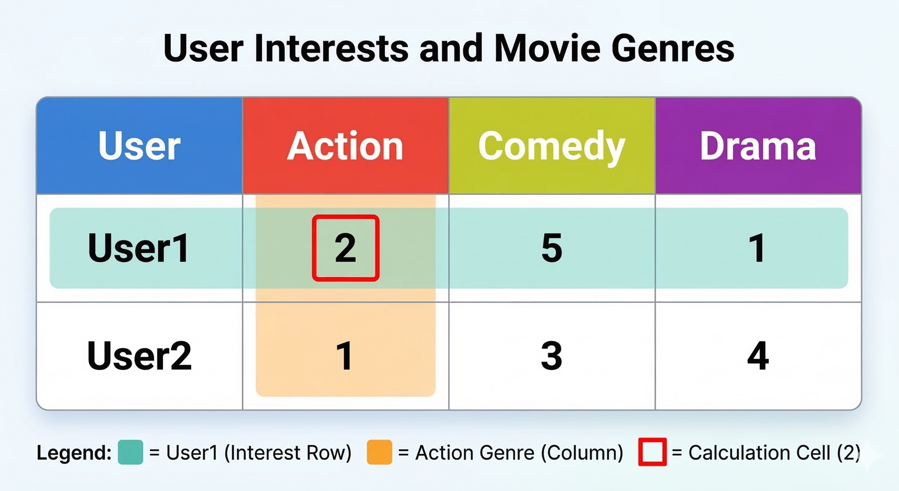
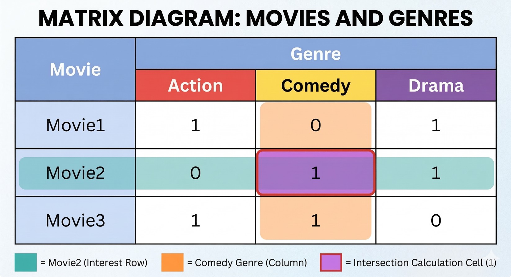
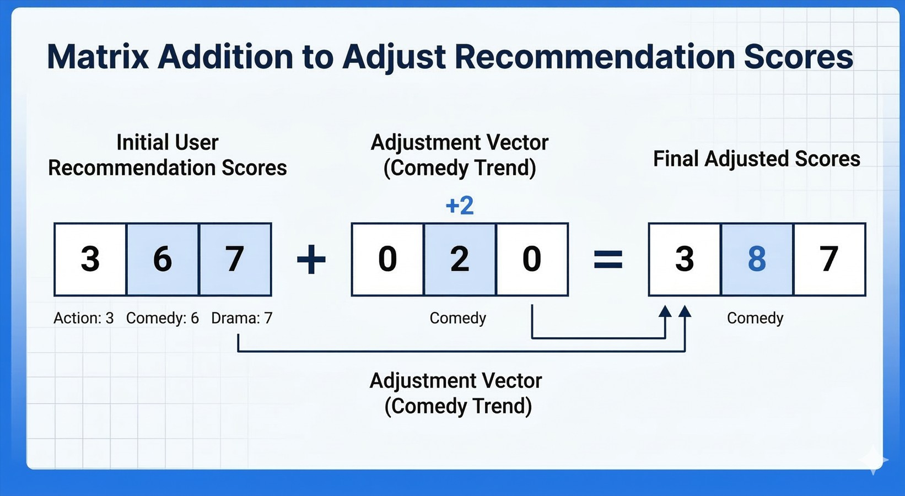

# How AI Recommendation Systems Actually Work

*(Explained with Simple Mathematics We Learned in School)*


Every day, artificial intelligence quietly decides what we watch, read, and buy.

When you open YouTube, it recommends videos.</br>
When you browse Netflix, it suggests movies.</br>
When you shop on Amazon, it shows products you might like.</br>

We often hear statements like:</br>
✅ "YouTube uses AI to recommend videos."</br>
✅ "Netflix knows what you'll watch next."</br>
✅ "Amazon recommends products for you."</br>

But most explanations stop there.

They tell us **that AI recommends things**, but they rarely explain **how it actually works behind the scenes**.

Surprisingly, the core idea behind many recommendation systems is not extremely complex.
In fact, it comes from something many of us learned in school:

**Matrix multiplication and basic linear algebra.**

Yes — the same math concepts we once solved in a classroom can help power modern AI systems used by millions of people.

Let’s break it down step by step with a simple example.

--- 

# Step 1 — Representing User Interests as a Matrix

Imagine we want to build a **movie recommendation system**.

First, we need to understand **what users like**.

Suppose we have **two users** and **three movie genres**:

* Action
* Comedy
* Drama

We record how much each user likes each genre.

| User  | Action | Comedy | Drama |
| ----- | ------ | ------ | ----- |
| User1 | 2      | 5      | 1     |
| User2 | 1      | 3      | 4     |

This table can be written as a **matrix**.

```
U = | 2  5  1 |
    | 1  3  4 |
```

Meaning:

Rows → Users
Columns → Genres
Numbers → Level of interest

Interpretation:

* **User1 loves Comedy the most**
* **User2 loves Drama the most**

📌 This matrix represents **user preferences**.

    💡 In real systems like Netflix, these numbers aren't typed manually — they're automatically learned from your viewing history, ratings, and watch time.



---

# Step 2 — Representing Movies as Another Matrix

Now we need information about the **movies themselves**.

Each movie belongs to one or more genres.

Suppose we have **3 movies**:

| Movie  | Action | Comedy | Drama |
| ------ | ------ | ------ | ----- |
| Movie1 | 1      | 0      | 1     |
| Movie2 | 0      | 1      | 1     |
| Movie3 | 1      | 1      | 0     |

This means:

* Movie1 → Action + Drama
* Movie2 → Comedy + Drama
* Movie3 → Action + Comedy

Matrix form:

```
M = | 1  0  1 |
    | 0  1  1 |
    | 1  1  0 |
```

Meaning:

Rows → Genres
Columns → Movies
Numbers → Whether the genre exists in the movie

📌 This matrix represents **movie characteristics**.


---

# Step 3 — Matrix Multiplication (The Core of Recommendations)

Now comes the **most important step**.

We combine the **User matrix** and the **Movie matrix**.

Mathematically:

```
Recommendation Matrix = U × M
```

Why multiplication?

Because we want to **combine user interest with movie genres**.

For each movie, we calculate:

**User interest × Movie genre presence**

---

## Example Calculation

For **User1 and Movie1**

```
2 × 1  +  5 × 0  +  1 × 1
= 2 + 0 + 1
= 3
```

For **User1 and Movie2**

```
2 × 0 + 5 × 1 + 1 × 1
= 0 + 5 + 1
= 6
```

For **User1 and Movie3**

```
2 × 1 + 5 × 1 + 1 × 0
= 2 + 5 + 0
= 7
```

So the recommendation score becomes:

```
User1 → [3, 6, 7]
```

Higher score → Higher chance the user will like the movie.

If we repeat the process for **User2**, we get:

```
User2 → [5, 7, 4]
```

Final recommendation matrix:

```
R = | 3  6  7 |
    | 5  7  4 |
```

Meaning:

Rows → Users
Columns → Movies

📌 This matrix tells us **how much each user is predicted to like each movie**.

 
---

# Step 4 — Adjusting Scores Using Matrix Addition

Sometimes recommendation systems apply **extra adjustments**.

For example:

* Trending content
* Recently popular genres
* Sponsored content
* Seasonal trends

Suppose **Comedy movies are trending today**.

We add a boost:

```
Adjustment = [0, 2, 0]
```

Now we add this to the recommendation scores.

Example for **User1**

```
[3, 6, 7] + [0, 2, 0]
= [3, 8, 7]
```

Now **Movie2 becomes more recommended**.

📌 Matrix addition allows the system to **adjust recommendations dynamically**.


---

# Step 5 — Ranking the Movies

Finally, the system sorts movies by score.

For **User1**

| Movie  | Score |
| ------ | ----- |
| Movie3 | 7     |
| Movie2 | 6     |
| Movie1 | 3     |

So the recommendation order is:

1️⃣ Movie3
2️⃣ Movie2
3️⃣ Movie1

The system recommends the **top movies first**.


---

# How Real AI Systems Expand This Idea

Real-world systems are much larger.

Instead of:

* 2 users
* 3 movies

Platforms like **YouTube or Netflix** work with:

* Millions of users
* Millions of videos
* Thousands of features

They also include additional signals like:

* Watch time
* Click behavior
* Search history
* Similar users
* Content similarity

Many modern systems use techniques such as:

* **Collaborative Filtering**
* **Matrix Factorization**
* **Neural Recommendation Models**
* **Embedding Vectors**

But at the core, the idea is still about **combining user preferences with item features mathematically**.

---

# Why This Is Beautiful

What makes this fascinating is that the **same mathematics we study in school** powers some of the most advanced AI systems today.

A simple concept like:

**Matrix Multiplication**

can help answer a very human question:

*"What should I watch next?"*

---

# Final Thought

The next time you see a video recommended on YouTube or a movie suggested on Netflix, remember:

Behind that recommendation is not magic.

It’s mathematics.

And often, it starts with something as simple as **a matrix multiplication problem we once solved in school.**

--- 