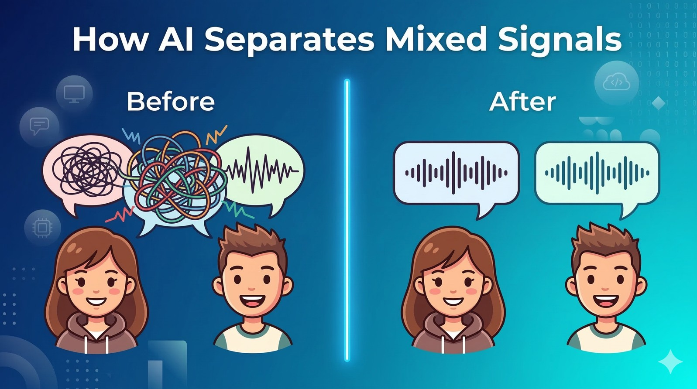
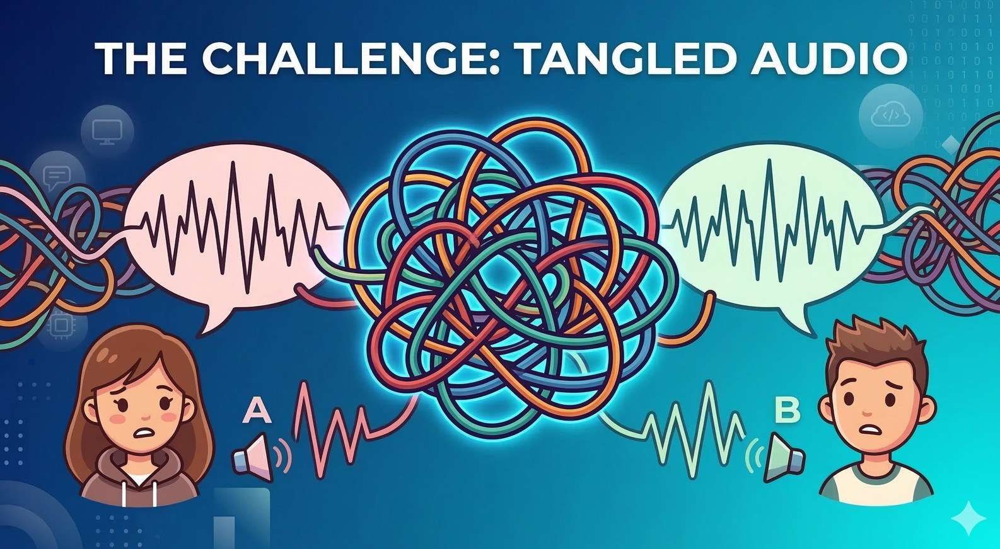
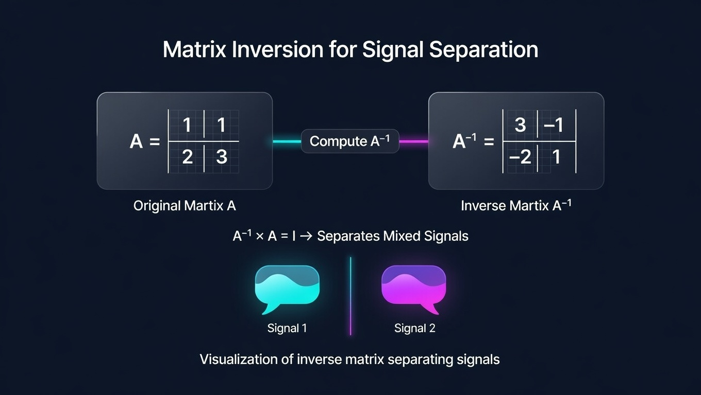
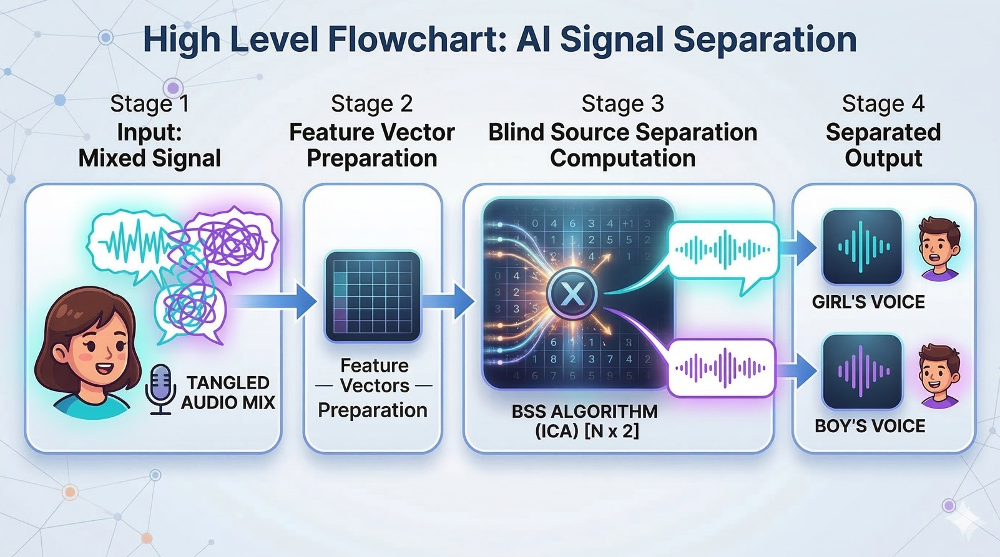
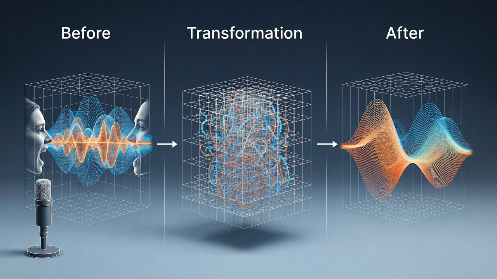

# How AI Separates Mixed Signals

_(Explained with Simple Linear Algebra)_


Imagine you are standing in a crowded room.

Two people are speaking at the same time.

You place **two microphones** in the room to record them.

But when you listen to the recordings, something unexpected happens.

Neither microphone captured a single clear voice.

Instead, both microphones recorded **a mixture of the two voices**.

Now here is the fascinating question:

**Can a computer recover the original voices from these mixed recordings?**

Surprisingly, the answer is **yes**.

And the mathematics behind this solution is something many of us studied in school but rarely saw applied in real life:

**Linear algebra — matrices, vectors, and inverse matrices.**

This problem is known in AI and signal processing as **Blind Source Separation**, and it plays an important role in technologies like speech processing, noise removal, and audio analysis.

Let’s break this idea down step by step using a simple example.

---

# Step 1 — The Real Situation

Imagine two people speaking:

- **Voice 1** → Person A
- **Voice 2** → Person B

Two microphones record the sound.

But instead of hearing each voice separately, the microphones capture **mixed signals**.

For example:

```
mic1 = voice1 + voice2
mic2 = 2*voice1 + 3*voice2
```

This means:

- Microphone 1 hears **both voices equally**
- Microphone 2 hears **a stronger mixture**

📌 In real life this happens because microphones are placed at **different distances from speakers**.



---

# Step 2 — Representing the Mixing Process with a Matrix

In linear algebra, we can represent this mixing process using a **matrix**.

```
A = | 1  1 |
    | 2  3 |
```

What does this matrix represent?

Rows → Microphones
Columns → Voices

So:

- Row 1 → what **mic1** records
- Row 2 → what **mic2** records

Columns represent how much of each **voice contributes to the recording**.

Interpretation:

- mic1 hears **1×voice1 + 1×voice2**
- mic2 hears **2×voice1 + 3×voice2**

## This matrix **A** is called the **mixing matrix**.

# Step 3 — Writing the Problem Using Linear Algebra

Now we represent the **true voices** using a vector.

```
v = | voice1 |
    | voice2 |
```

The microphones record another vector:

```
m = | mic1 |
    | mic2 |
```

The mixing process becomes a simple linear algebra equation:

```
m = A v
```

This equation means:

**Microphone recordings = Mixing Matrix × True Voices**

## So the microphones contain **mixed information about both voices**.

# Step 4 — What We Actually Want

In reality we **do not know the true voices**.

We only know the recordings:

```
mic1
mic2
```

But our goal is to recover:

```
voice1
voice2
```

To solve this, we use an important concept from linear algebra:

**The inverse matrix.**

If we multiply both sides by the inverse of A:

```
v = A⁻¹ m
```

This means:

**True voices = Inverse Matrix × Microphone recordings**

The inverse matrix essentially **undoes the mixing process**.

---

# Step 5 — Computing the Inverse Matrix

First we calculate the **determinant** of the matrix.

```
det(A) = (1×3) − (1×2) = 1
```

Since the determinant is **not zero**, the inverse exists.

For a 2×2 matrix:

```
A⁻¹ = 1/det(A) * | d  -b |
                 | -c  a |
```

So the inverse becomes:

```
A⁻¹ = | 3  -1 |
      | -2  1 |
```

This matrix will allow us to **separate the mixed signals**.

---

# Step 6 — Recovering the Original Voices

Now we multiply:

```
v = A⁻¹ m
```

Which gives:

```
| voice1 |   | 3  -1 | | mic1 |
| voice2 | = | -2  1 | | mic2 |
```

This transformation separates the mixed signals.



---

# Step 7 — Example with Real Numbers

Suppose the microphones recorded:

```
mic1 = 7
mic2 = 20
```

These values represent **mixed sound energy captured by the microphones**.

Now compute the voices.

### Voice 1

```
voice1 = 3 × mic1 − mic2
voice1 = 3(7) − 20
voice1 = 21 − 20 = 1
```

### Voice 2

```
voice2 = −2 × mic1 + mic2
voice2 = −2(7) + 20
voice2 = −14 + 20 = 6
```

---

# Step 8 — Final Result

We successfully recovered the original voices:

```
voice1 = 1
voice2 = 6
```

Even though the microphones recorded **only mixed signals**, linear algebra allowed us to **separate the original sources**.

This is the core idea behind **signal separation algorithms**.



---

# Step 9 — Where This Is Used in AI

This mathematical idea appears in several real-world AI systems.

A famous method is:

**Independent Component Analysis (ICA)**

ICA is used for problems like:

• Separating multiple speakers in audio recordings
• Removing noise from signals
• Analyzing brain signals (EEG)
• Financial signal analysis
• Music source separation



---

# Step 10 — Why the Determinant Matters

The determinant tells us whether the system can be **reversed**.

If:

```
det(A) = 0
```

then the inverse matrix **does not exist**.

This means the microphones lost some information during mixing.

In that case:

**It becomes impossible to perfectly separate the voices.**

So the determinant tells us whether **signal separation is mathematically possible**.

---

# Why This Is Fascinating

What makes this example beautiful is that a **simple linear algebra concept** can solve a complex real-world problem.

A concept we learn in school:

**Matrices and inverse matrices**

can help answer a practical AI question:

_"How can we separate mixed signals into their original sources?"_

---

# Final Thought

One of the most fascinating aspects of artificial intelligence is that many powerful systems are built on mathematical ideas we first encountered in school.

Concepts like **matrices, vectors, and inverse matrices** may seem abstract in a classroom, but they quietly power technologies used in the real world every day.

From **separating voices in noisy recordings** to **analyzing brain signals** and improving audio quality, linear algebra continues to play a critical role in modern AI systems.

So the next time you hear clean audio extracted from a noisy recording or read about AI separating complex signals, remember:

Behind the scenes, it is not magic.

It is mathematics.

Often beginning with something as simple as **a matrix equation from linear algebra**.

---

💬 **Discussion**

Did this example change how you think about **inverse matrices or linear algebra**?

Which AI concept would you like to see explained next in a simple way?

• Neural Networks
• Search Algorithms
• How large language models like GPT work
• Another real-world application of linear algebra

Share your thoughts in the comments — I’d love to hear what topics interest you most.

---

⭐ If you found this explanation helpful, consider sharing it with someone who once learned matrices in school but never realized how powerful they could be in modern technology.

---
