# System Design: From Zero to Millions of Users

Ever wondered how a simple app grows into a platform serving millions of users worldwide?

This guide takes you on that journey—step by step. Starting from a basic single-server setup, we’ll explore how systems evolve into powerful, scalable, and distributed architectures. Along the way, you’ll learn how to design systems that are fast, reliable, and built to handle real-world challenges.

Whether you're preparing for interviews, building your own product, or just curious about how large-scale systems work—this guide is for you.

👉 By the end, you won’t just understand system design—you’ll think like a system designer.

---

# 1. Single Server Architecture

## Overview

In the initial stage, a single server handles:

* Web application (backend)
* Database
* File storage

## Architecture

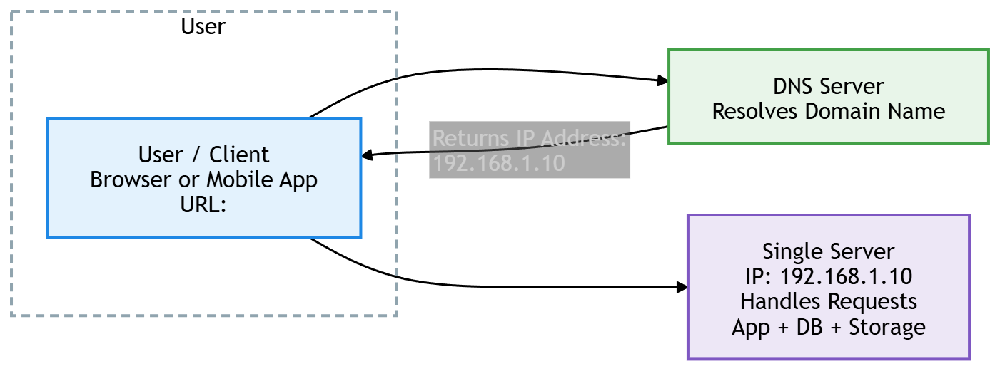
 

## Characteristics

* Simple to build and deploy
* Low cost
* Suitable for early-stage applications or prototypes

## Limitations

* Single point of failure
* Limited compute and storage capacity
* Cannot handle high traffic
* Performance degradation under load

--- 

# 2. Database Systems

A database is responsible for storing and managing application data.

## 2.1 Relational Database (SQL)

* Structured data model (tables, rows, columns)
* Enforces schema and relationships

Examples: MySQL, PostgreSQL

### Use cases

* Banking systems
* E-commerce orders
* User accounts

### Advantages

* Strong consistency
* ACID properties
* Reliable for structured data


---

## 2.2 Non-Relational Database (NoSQL)

* Flexible schema (document, key-value, column, graph)
* Designed for scalability and distributed systems

Examples: MongoDB, Redis, Cassandra

### Use cases

* Chat applications
* Real-time analytics
* Social feeds

### Advantages

* Horizontal scalability
* Flexible data models
* High performance for large-scale systems

---     
# 3. Scaling Strategies


## 3.1 Vertical Scaling (Scale Up)

### Definition

Increasing the capacity of a single machine by adding:

* CPU
* RAM
* Storage

### Example

Upgrading a server from 8GB RAM to 64GB RAM

## Architecture

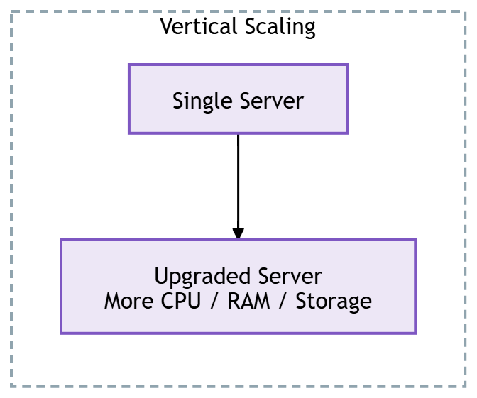

### Advantages

* Simple to implement
* No architectural changes required

### Limitations

* Hardware limits
* Expensive at high levels
* Single point of failure remains

---

## 3.2 Horizontal Scaling (Scale Out)

### Definition

Adding more servers to distribute load across multiple machines.

### Example

Instead of one server, use multiple servers behind a load balancer.

## Architecture

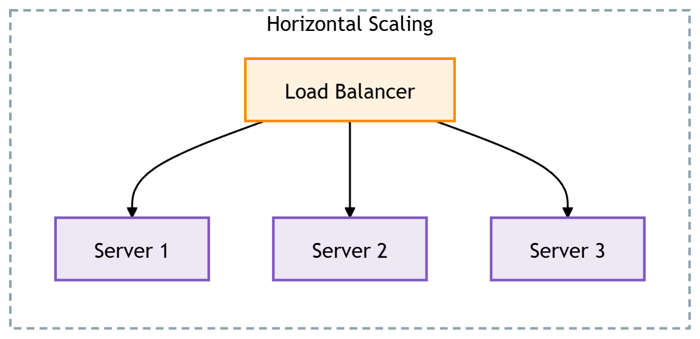

### Advantages

* High scalability
* Better fault tolerance
* Cost-effective at scale

### Limitations

* System complexity increases
* Requires distributed system design

---

# 4. Load Balancer

## Overview

A load balancer distributes incoming traffic across multiple servers.

## Architecture

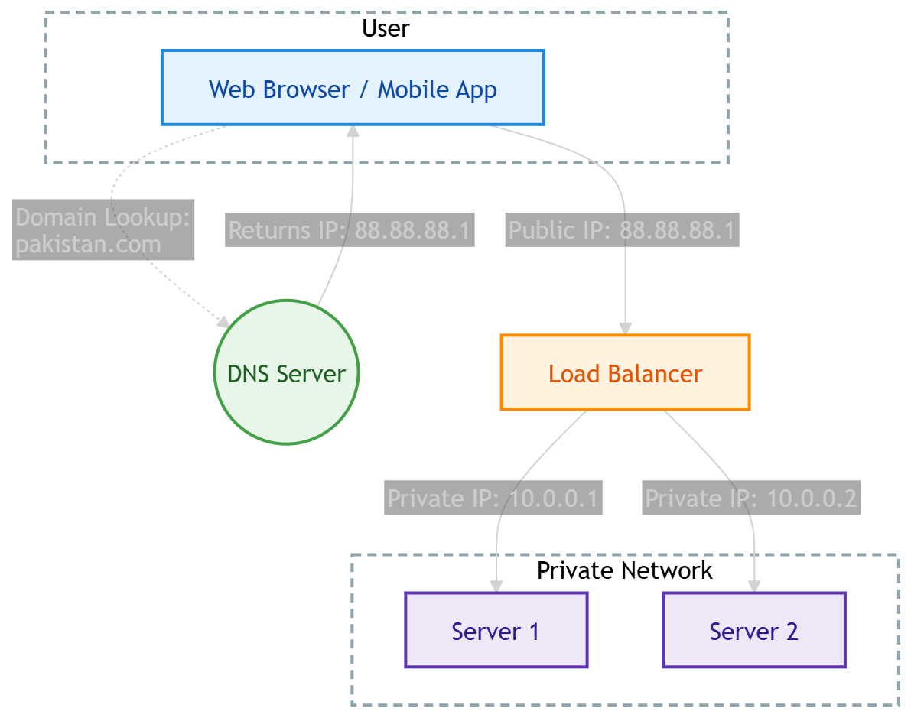

## Benefits

* Prevents overloading a single server
* Improves availability
* Enables horizontal scaling
* Supports failover (if one server fails, traffic is redirected)

 
---


# 5. Database Replication

## Overview

Database replication involves copying data from a primary database to one or more replicas.

## Architecture

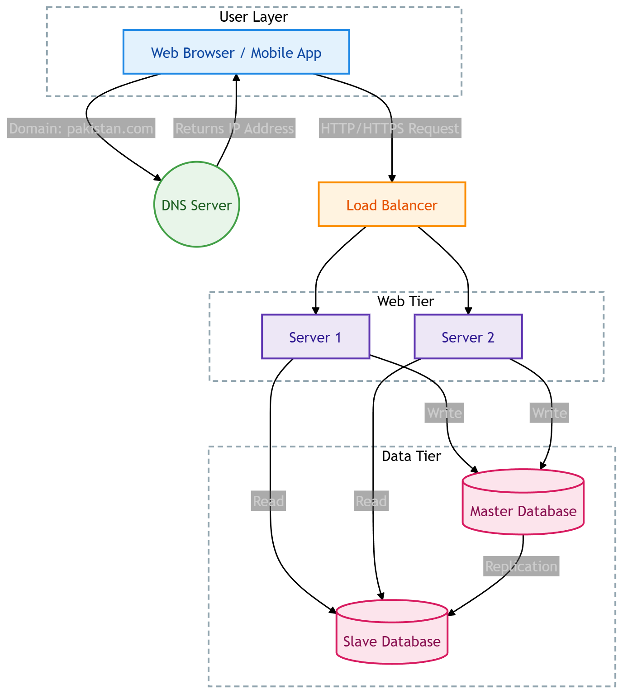


## Roles

* Master: Handles write operations
* Replicas: Handle read operations

## Advantages

* Improved read performance
* High availability
* Data redundancy

## Failure Handling

* If a replica fails, traffic is redirected to other replicas           
* If the master fails, a replica is promoted to master

---


 
# 6. Caching Layer

## Overview

A cache stores frequently accessed data in memory for fast retrieval.

## Architecture
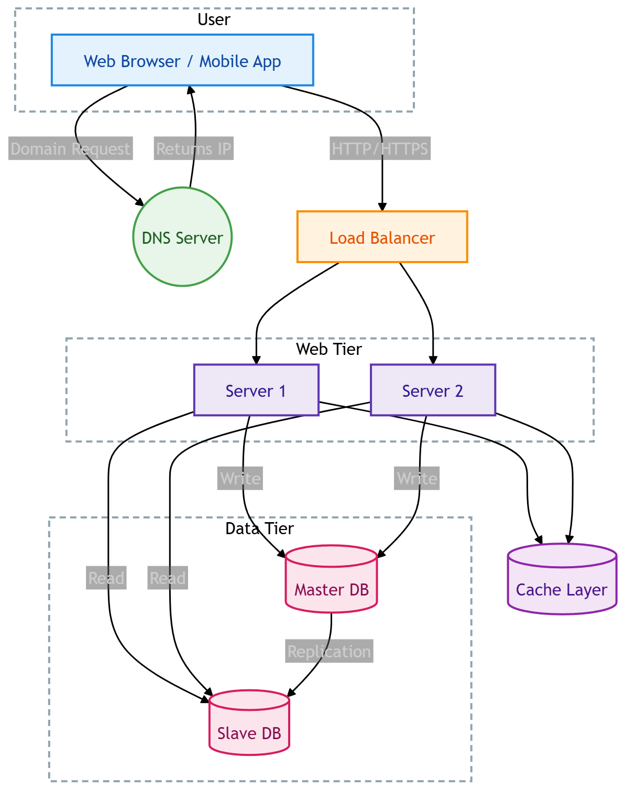

<!-- Or control both width and height --> 


## Use Cases

* Frequently accessed user profiles
* Product listings
* Session data


 
## Benefits

* Reduces database load
* Improves response time
* Enhances scalability

---

## Cache Policies

### 1. Cache Expiration (TTL)

Data is automatically removed after a defined time period.

### 2. Cache Eviction

When cache is full, data is removed based on policies such as:

* Least Recently Used (LRU)
* First In First Out (FIFO)
* Least Frequently Used (LFU)

### 3. Consistency

Cache and database must remain synchronized. This is a key challenge in distributed systems.

---

 


 
 
 
 
 
 
# 7. Content Delivery Network (CDN)

## Overview

A CDN is a distributed network of servers that delivers static content closer to users.

## Content Types

* Images
* Videos
* CSS
* JavaScript files

## Architecture
 
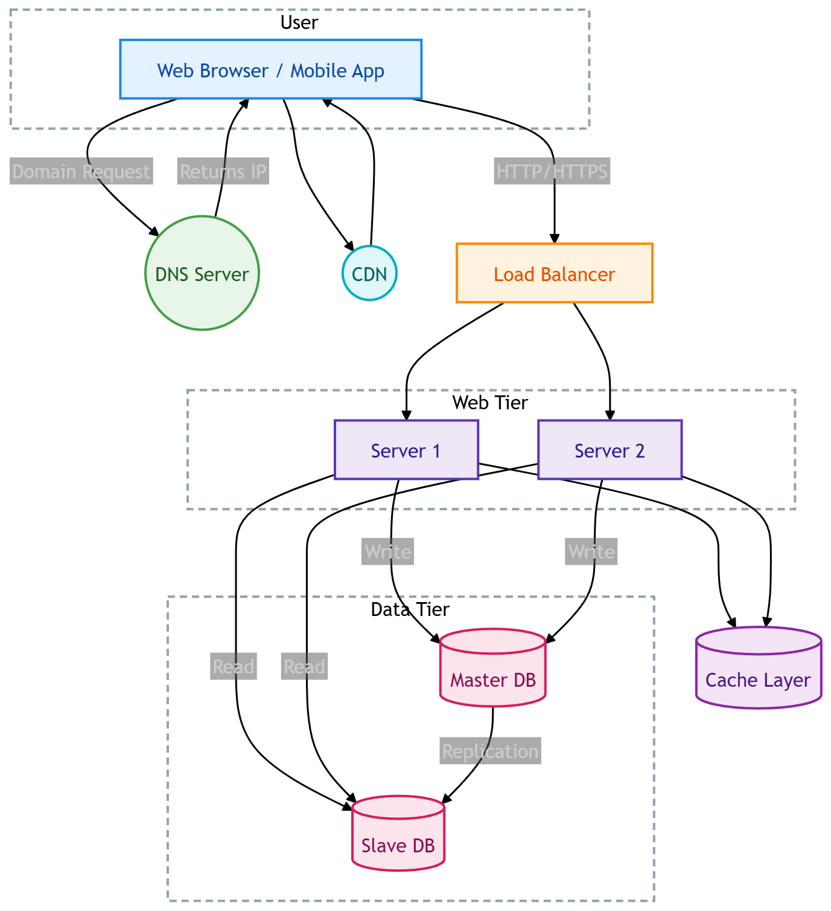

## Working

1. User requests a static asset
2. CDN checks cache
3. If not available, fetches from origin
4. Stores and serves content to future users

## Benefits

* Reduced latency
* Lower server load
* Improved global performance

---
# 8. Stateless vs Stateful Architecture

## 8.1 Stateful Architecture

### Definition

Servers store user session data locally.

## Architecture

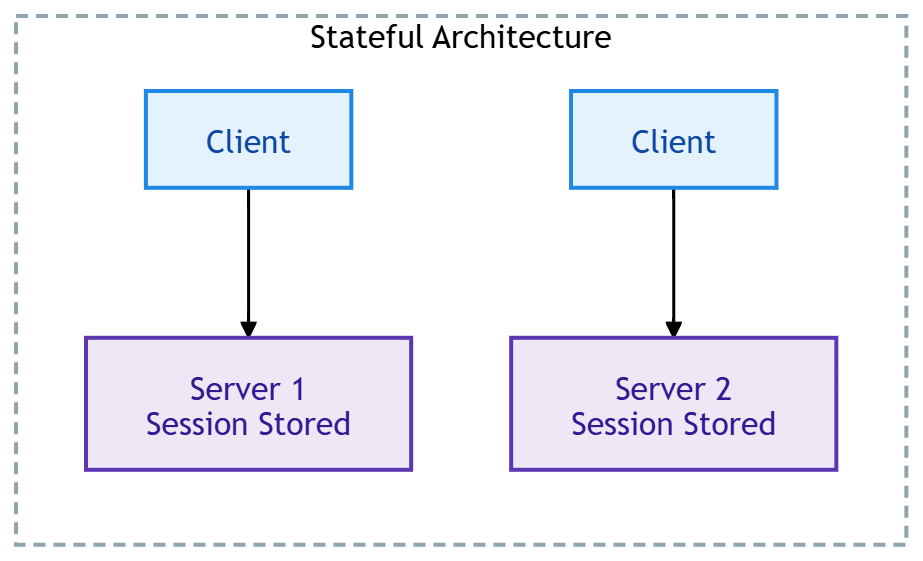

### Problem

* Requests must be routed to the same server (sticky sessions)
* Poor scalability 
---
 
## 8.2 Stateless Architecture

### Definition

Servers do not store session state. State is stored in a shared database or cache.


## Architecture

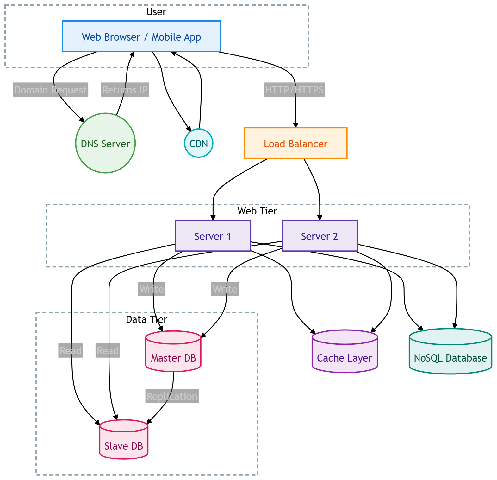

### Benefits

* Easy horizontal scaling
* Improved reliability
* Better fault tolerance
* Simplified deployment

---

# 9. Multiple Data Centers

## Overview

Systems are deployed across multiple geographic regions.

## Architecture

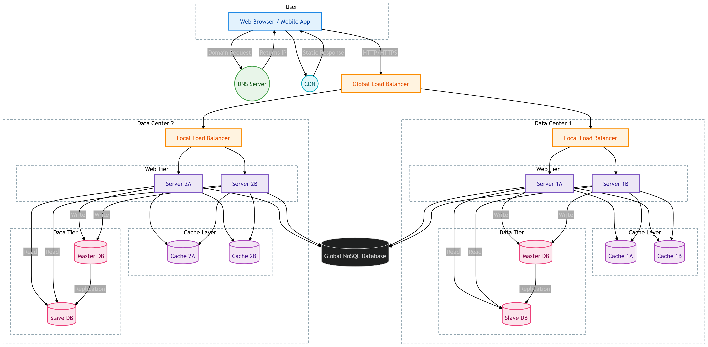


## Benefits

* Reduced latency for global users
* High availability
* Disaster recovery

## Failure Handling

If one data center fails, traffic is redirected to another active region.

---


 


# 10. Message Queue

## Overview

A message queue enables asynchronous communication between services.

## Architecture

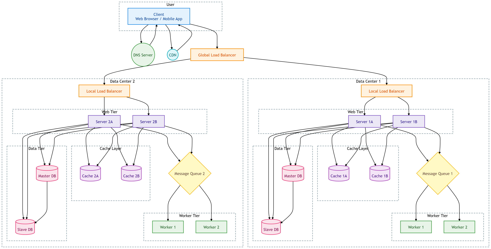

## Example Use Case

Image processing pipeline:

* User uploads image
* Task is added to queue
* Worker processes image asynchronously

## Benefits

* Decouples system components
* Handles traffic spikes efficiently
* Improves system reliability
* Enables asynchronous processing

---
 
 
 

# 11. Logging, Metrics, and Automation

## 11.1 Logging

Captures system events and errors for debugging and monitoring.

## 11.2 Metrics

Tracks system performance and business indicators:

* CPU usage
* Response time
* Active users
* Revenue

## 11.3 Automation

Includes:

* Continuous Integration (CI)
* Continuous Deployment (CD)
* Auto-scaling systems
* Automated testing

## Benefits

* Faster development cycles
* Early detection of issues
* Improved system reliability

---

# 12. Database Scaling

## 12.1 Vertical Scaling

Increasing hardware capacity of a single database server.

## 12.2 Horizontal Scaling (Sharding)

### Definition

Splitting a database into multiple smaller databases called shards.

### Example

```
User ID % 4 → Shard selection
```

## Advantages

* Handles large datasets
* Distributes load evenly

## Challenges

* Complex joins across shards
* Data rebalancing (resharding)
* Hotspot issues (uneven traffic distribution)

---

# Final System Architecture (High Level)

A fully scaled system includes:

* DNS routing
* CDN for static content
* Load balancer
* Stateless web servers
* Cache layer
* Message queue
* Replicated and sharded databases
* Multiple data centers
* Monitoring and automation tools

---

# Key Takeaway

Scaling a system is an iterative process of:

* Removing bottlenecks
* Distributing load
* Decoupling components
* Improving fault tolerance

A well-designed system ensures:

* High availability
* Horizontal scalability
* Performance under high traffic
* Maintainability at scale


#  Final Insight (Very Important)

Scaling is NOT about making one system powerful.

👉 It is about:

> **Breaking a big system into smaller, independent, fast, and reliable parts**

---
 